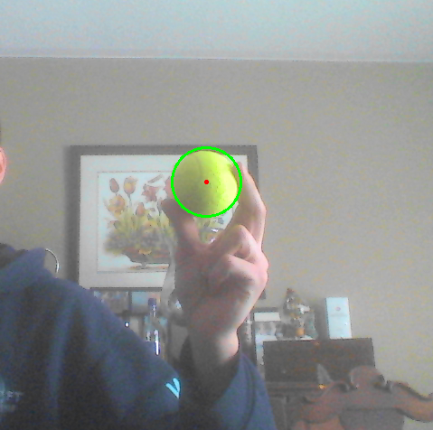

# Tracking Tennis Balls

Track the position of tennis balls in a webcam video capture.

## Requirements

This project was written in Python 2.7 and utilized OpenCV 2.4.12.

## Usage

Simply run the python file *tracked.py*. Nothing special.

Windows:

`tracked.py`

Mac/Linux:

`python ./tracked.py`
